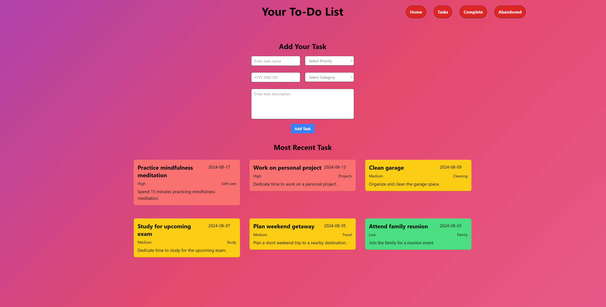
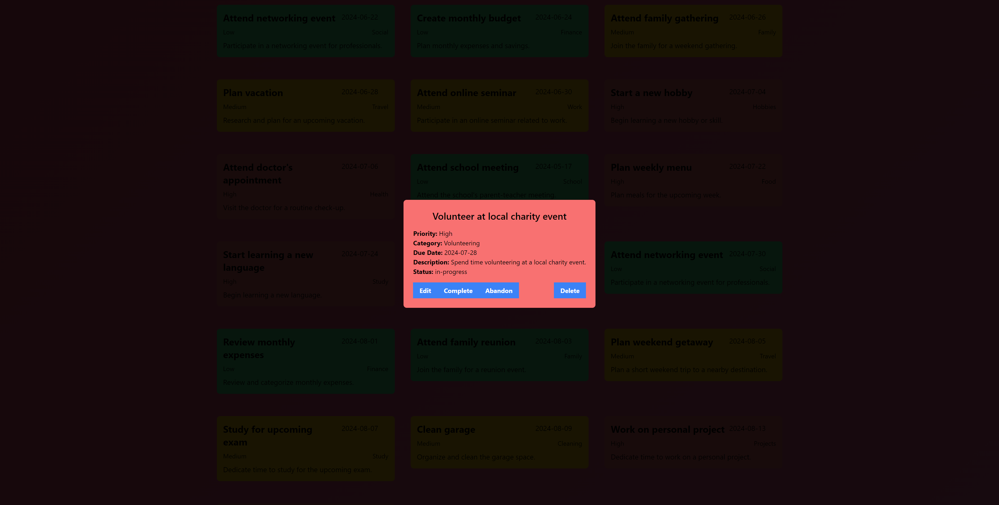
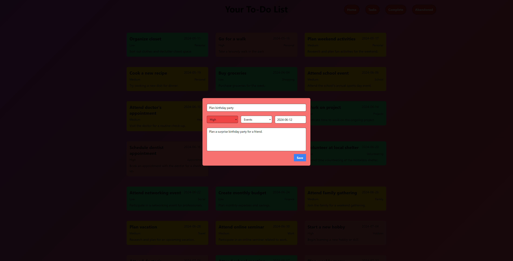
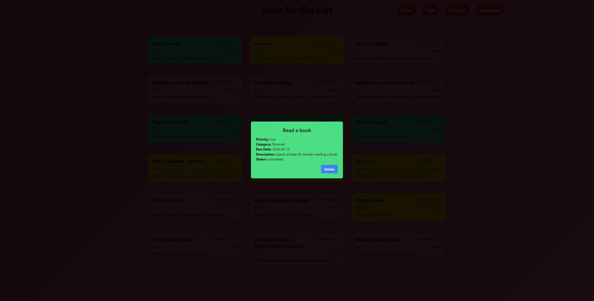
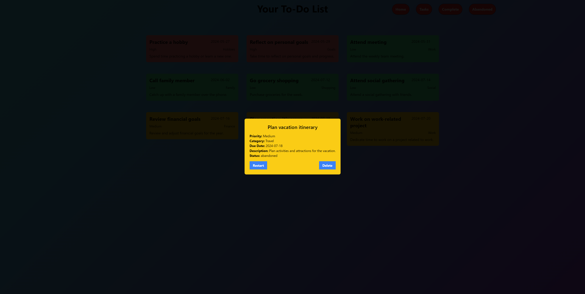
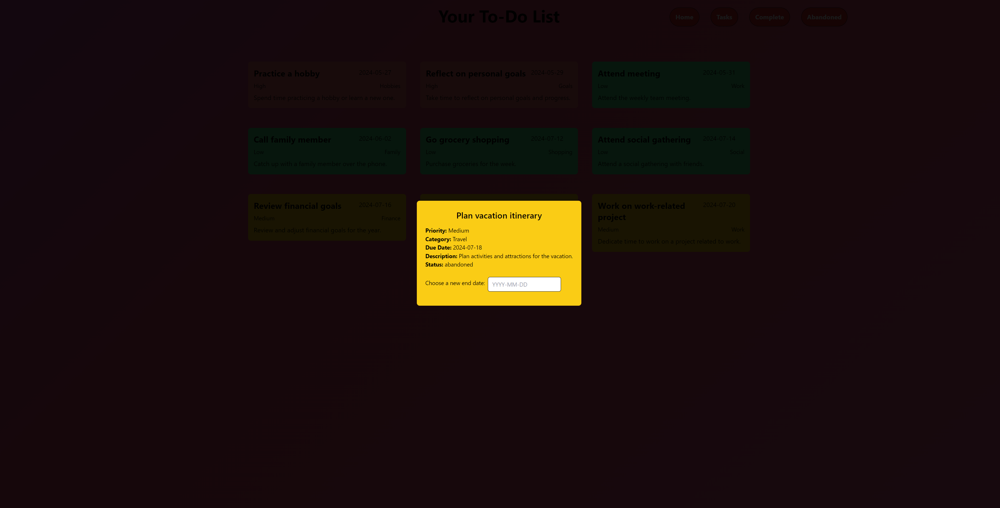

# Todo List Project

This is a simple Todo List project where you can manage your tasks efficiently. It allows you to add, edit, complete, and abandon tasks with various attributes such as priority, category, name, description, and end date.

## Features

- View 6 recent tasks on the home screen.
- Add tasks with attributes such as color coded priority, category, name, description, and end date.
- View, complete, edit, and abandon tasks in the tasks section.
- Restart abandened tasks in abandoned page.
- View completed tasks with the ability to delete them.

## Setup

1. Install dependencies:
    npm install

2. Run JSON server to serve data:
    json-server --watch data.json

3. Run the development server:
    npm run dev

4. Access the project on http://localhost:5173/

### Screenshots of project:

#### Home Screen

#### Task Popup

#### Task Edit Popup

#### Completed Tasks Popup

#### Restart Popup

#### Restart Popup new end date selection

